# ユーザーフロー詳細（EC 価格管理ツール Clever）

## このドキュメントについて

**対象読者**: 本ツールを初めて見る方（開発者・くればぁ様の担当者・レビュアー）。事前知識は不要です。

**目的**: 営業担当者が問い合わせを受けてから見積金額を出すまでに、どの画面で何を入力し、システムが**どのデータをどのロジックで評価して**結果を返すのかを、パターン別に追えるようにします。

**読み方**:
- 「業務の流れだけ知りたい」→ 1章・2章・5章
- 「実装の判定ロジックを知りたい」→ 3章・4章・6章
- 「今どこまで使えるのか知りたい」→ 7章

**記載内容の基準**: 2026-07-27 時点の本番稼働コード（`src/`）と本番配信中の `unified.json`（18,122 件）の実測値に基づきます。件数はすべて実測値です。

## 1. ツール導入前の業務フロー（現状の課題）

6/12 の打ち合わせで営業担当者が説明された、現在の見積作成手順です。**1 件の見積に約 3 日**かかっています。

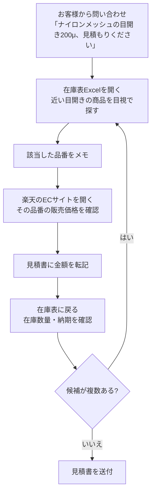

ボトルネックは 3 点です。

1. **データソースが 3 つに分かれている**: 在庫表（Excel）・EC サイト・見積書。画面を行き来する
2. **候補が複数あると回数分だけ繰り返す**: 条件に合う商品を全部出したいが、1 件ずつ EC サイトを見るため時間がかかる
3. **絞り込みを人力でやっている**: お客様に「材質は何がいいですか」とヒアリングして候補を減らしている。本来は条件に合うものを全部出せば済む

**本ツールの狙いは、この 3 つを 1 画面に集約すること**です。

## 2. ツール導入後の業務フロー（あるべき姿）

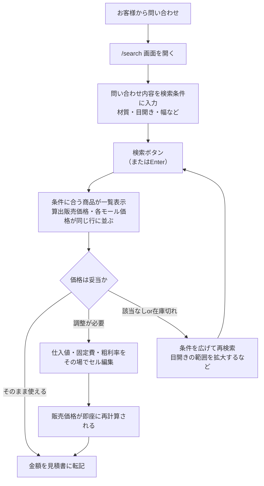

## 3. データの構造（どの数字がどこから来るか）

画面に出る値は 3 つの層が重なってできています。**この 3 層を理解すると、以降のフローがすべて追えます。**

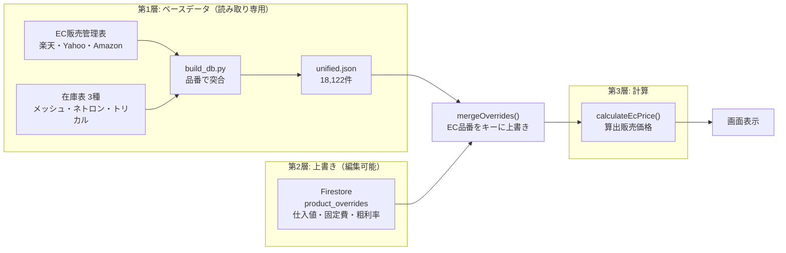

### 第 1 層: ベースデータ `unified.json`

`resource/build_db.py` が EC 販売管理表と在庫表 3 種を**社内品番で突合**して生成します。ブラウザは起動時にこのファイル（約 6.2MB）を丸ごと取得し、メモリ上に保持します。**検索はすべてブラウザ内で完結し、サーバーへの問い合わせは発生しません。**

行の単位は **EC 品番**（楽天・Yahoo・Amazon いずれかの商品コード）です。同じ社内品番でも「1m 品」「3m 品」で EC 品番が別なので、別行になります。

| 由来 | 主なカラム |
|---|---|
| EC 販売管理表 | `ec_hinban`, `hinban`（社内品番）, `zaishitsu`（材質）, `color`, `size`, `tehai`（手配方法）, 楽天/Yahoo/Amazon 価格 |
| EC 販売管理表の `size` から抽出 | `cut_m`（カット長）— 「1400mm*3ｍ」→ 3 |
| 在庫表（突合できた行のみ） | `shiire_per_m`（仕入値/m）, `nokori_m`（在庫残）, `meopen_um`（目開き）, `mesh_count`（メッシュ数）, `zaiko_haba_mm`（幅）, `zaiko_source`（どの在庫表か） |
| 在庫表の値から計算 | `senkei_um`（線径）= 25400 ÷ メッシュ数 − 目開き<br>`kaikouritsu`（開口率）= (目開き ÷ (25400 ÷ メッシュ数))² × 100 |
| 突合結果の記録 | `zaiko_match`（どの方法で当たったか）, `zaiko_status`（当たらなかった理由） |

**重要な性質**: 在庫表と突合できなかった行では、仕入値・目開き・メッシュ数・在庫残がすべて空になります。18,122 件中 3,367 件（18.6%）しか突合できていません（詳細は 7 章）。

### 第 2 層: 上書き `product_overrides`（Firestore）

営業担当者が画面で編集した値を保存します。**EC 品番をドキュメント ID** とし、`shiire_per_m` / `kotei_hi` / `arari_rate` の 3 つだけを保持します。

この層が独立している理由は、**ベースデータを再生成しても編集内容が消えないようにするため**です。CSV を入れ直しても、EC 品番が同じなら上書きは生き残ります。

### 第 3 層: 計算

```
販売価格 = (仕入値/m × カット長 + 固定費) ÷ (1 − 粗利率)
```

デフォルト値は固定費 6,000 円、粗利率 50% です。第 2 層で上書きされていればその値が使われます。

**仕入値とカット長の両方が揃わないと `null`（画面上は「-」）になります。** 片方でも欠けたら計算しません。

## 4. 画面と操作の全体像

### 画面構成

| パス | 役割 |
|---|---|
| `/` | ホーム。総商品数・仕入値あり件数・販売価格算出済み件数と、在庫表との突合状況を表示 |
| `/search` | **見積作業の主画面**。検索条件・結果テーブル・インライン編集 |
| `/overview` | ツールの説明ページ |

サイト全体に Basic 認証がかかっています。ユーザー名とパスワードは Vercel の環境変数で管理しています。

### `/search` 画面の 3 ブロック

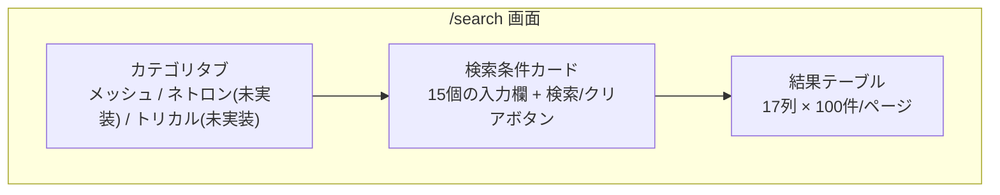

**カテゴリタブは現状ダミーです。** メッシュのみ選択可で、実際には全カテゴリのデータが混在して表示されます。ネトロン・トリカルは「未実装」バッジ付きでクリックできません。

### 検索条件の 15 項目

| 入力欄 | 対応カラム | 判定方式 |
|---|---|---|
| 材質 | `zaishitsu` | 部分一致（正規化あり） |
| 目開き(μm) 最小 / 最大 | `meopen_um` | 範囲 |
| メッシュ数 最小 / 最大 | `mesh_count` | 範囲 |
| 線径(μm) 最小 / 最大 | `senkei_um` | 範囲 |
| 開口率(%) 最小 / 最大 | `kaikouritsu` | 範囲 |
| 幅(mm) 最小 / 最大 | `zaiko_haba_mm` | 範囲 |
| 品番 | `hinban` | 部分一致（正規化あり） |
| EC品番 | `ec_hinban` | 部分一致（正規化あり） |
| カラー | `color` | 部分一致（正規化あり） |
| フリーワード | 5 カラム横断 | 部分一致（正規化あり） |

### 結果テーブルの 17 列

左から順に、EC品番 / 品番 / 材質 / 目開き(μm) / メッシュ数 / 線径(μm) / 開口率(%) / 幅(mm) / サイズ / カラー / **仕入値(/m)** / **固定費** / **粗利率** / 算出販売価格 / 楽天価格 / Yahoo価格 / Amazon価格。

太字の 3 列がインライン編集できる列です。全列がソート可能で、クリックするたびに「昇順 → 降順 → 解除」と 3 状態を巡回します。

## 5. 検索パターン別フロー

問い合わせの内容によって、営業担当者の入力と、システムの絞り込み方が変わります。ここでは 6 パターンを扱います。

### パターン A: 材質 + 目開き指定（最頻）

**起点となる問い合わせ**: 「ナイロンメッシュの目開き 200μ が欲しい。見積もりください」

これが 6/12 の打ち合わせで「大体こういう問い合わせが来る」と説明された最頻パターンです。

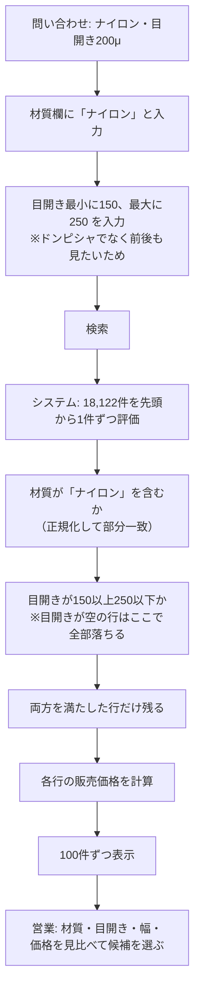

**システムが使う情報**: `zaishitsu` と `meopen_um` の 2 カラムのみです。両方の条件を**同時に満たす**行だけが残ります（AND 条件）。

**実データでの結果**: 材質「ナイロン」だけで 5,944 件。目開き 150〜250 を加えると **22 件**に絞られ、そのすべてに価格が出ます。

**注意すべき落とし穴が 2 つあります。**

第一に、**目開きが空の行は無条件で除外されます。** 目開きに最小値または最大値を 1 つでも入れた瞬間、目開きを持たない 17,859 件が候補から消えます。ナイロン 5,944 件のうち目開きを持つのはごく一部なので、絞り込みが一気に効きます。これは仕様として正しい動作ですが、「目開きの値が在庫表から取れていないだけで、実際には該当する商品」も一緒に消えている点に注意が必要です。

第二に、**「ポリエステル」と入力すると 0 件になります。** データ上の材質名は `PET`（205 件）で、「ポリエステル」という文字列はどこにも存在しません。同様に半角カナ表記（`ﾅｲﾛﾝ`）が使われていますが、こちらは正規化処理で全角「ナイロン」と一致するため問題ありません。材質名の呼び方とデータの表記が一致しない点は、運用上の注意事項です。

### パターン B: 材質未確定・スペックのみ指定

**起点となる問い合わせ**: 「目開き 200 ミクロンの樹脂のメッシュが欲しい」

材質が決まっていないケースです。打ち合わせでは「ナイロン、ポリエステル、PP とか全部価格が出てくれれば、それだけで見積もりができる」と説明されています。

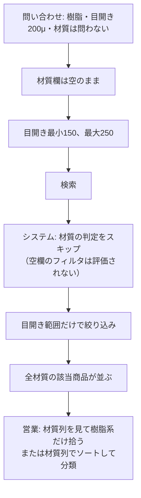

**システムが使う情報**: `meopen_um` のみです。入力が空の欄はフィルタとして評価されないため、材質を問わず全件が対象になります。

**実データでの結果**: 目開き 150〜250 で **42 件**、内訳はナイロン 22・PP 9・PET 6・ETFE 2・制電(カーボン) 2・シルク 1 です。うち 36 件に価格が出ます。

このパターンは**現状でも要望どおりに機能しています**。1 回の検索で複数材質の候補と価格が同時に並ぶため、旧フローで 3 日かかっていた作業がこの画面だけで完結します。

**制約**: 材質を「ナイロンまたはポリエステルまたは PP」のように複数指定することはできません。材質欄は 1 つで、部分一致の AND 条件だからです。複数材質を絞りたい場合は、材質を空にして全件出し、目視で拾うことになります。

### パターン C: 品番直接指定（リピート注文）

**起点となる問い合わせ**: 「前回と同じ N-13 を 5m でお願いします」

社内品番が分かっているケースです。

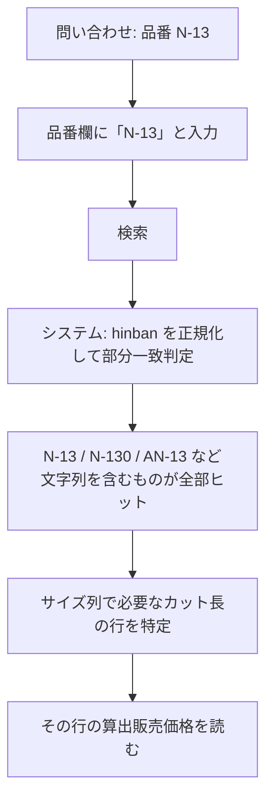

**システムが使う情報**: `hinban` のみです。**完全一致ではなく部分一致**なので、`N-13` で検索すると `N-130` も `AN-13` もヒットします。意図した品番を特定するには、サイズ列とカラー列を目で確認する必要があります。

**正規化の内容**: 小文字化 → 空白除去 → NFKC 正規化（全角/半角の統一）。したがって `PEEK-220` と `peek-220`、`ｎ-13` と `N-13` は同じものとして扱われます。ただし**ハイフンの有無は区別されます**。`PEEK220` で検索しても `PEEK-220` はヒットしません。

### パターン D: EC 品番からの逆引き

**起点となる問い合わせ**: 楽天の注文画面や問い合わせメールに EC 品番だけが書かれている

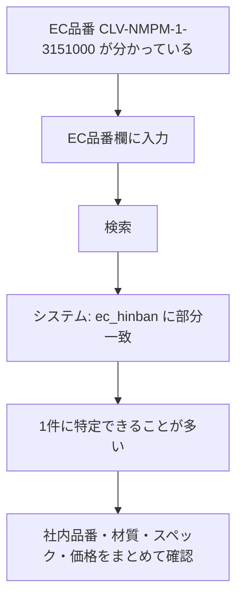

**システムが使う情報**: `ec_hinban` のみです。EC 品番は商品ごとに一意なので、通常 1 件に絞れます。

このパターンは**在庫表との突合状況に依存しません**。EC 品番と材質・サイズ・モール価格は EC 販売管理表から来ているため、突合できていない商品でも表示されます。ただし仕入値が無いため算出販売価格は「-」になり、参照できるのは楽天/Yahoo/Amazon の既存価格のみです。

### パターン E: フリーワード検索（当たりをつける）

**起点**: 条件が漠然としている。「防水シートみたいなやつ」

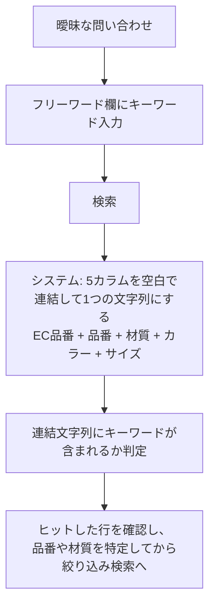

**システムが使う情報**: `ec_hinban` / `hinban` / `zaishitsu` / `color` / `size` の 5 つを空白でつないだ文字列です。

**注意点**: 連結してから部分一致を判定するため、**フィールドをまたいだ誤ヒットが起こりえます**。たとえば材質の末尾と カラーの先頭がつながった文字列がキーワードに一致する、といったケースです。当たりをつける用途には十分ですが、確定用には品番欄や EC 品番欄を使うべきです。

### パターン F: 在庫切れ時の代替提案（未実装）

**起点**: 該当商品は見つかったが在庫がない

打ち合わせでは「在庫がなかったら近い商品を提案する」機能（F4）が要望として挙がっていますが、**現状は未実装です**。

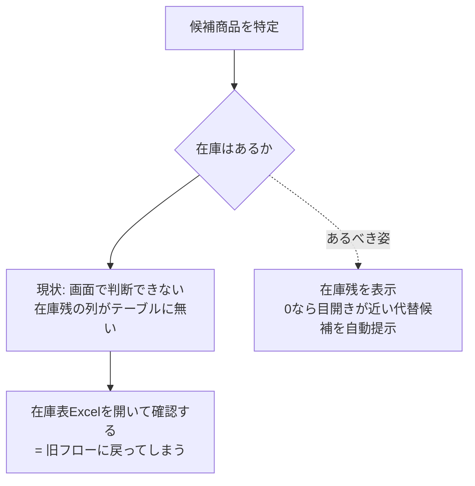

**現状の重大な欠落**: `unified.json` には在庫残（`nokori_m`）が 3,363 件分入っているにもかかわらず、**結果テーブルに在庫残の列がありません**。旧フローのボトルネック 3 点のうち「在庫表に戻って在庫・納期を確認」する部分が、ツールで解決されていない状態です。

代替提案の前に、まず在庫残を列として表示することが必要です。

## 6. システム内部の判定ロジック（詳細）

### 検索実行時の処理順序

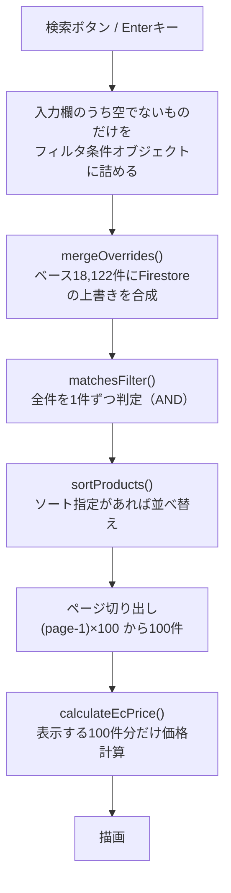

処理の順序に 2 つのポイントがあります。

**上書きの合成が絞り込みより先**です。したがって、編集で仕入値を入れた商品は、その値を使って価格が計算されます。

**価格計算は表示する 100 件分だけ**行います。18,122 件すべてを計算するわけではないため、ページ送りのたびに計算が走ります。

### フィルタ判定の詳細

すべてのフィルタは **AND 条件**です。入力した条件をすべて満たす行だけが残ります。OR 検索はできません。

**文字列フィルタ**（材質・品番・EC品番・カラー・フリーワード）

```
1. 入力値を正規化: 小文字化 → 空白と全角スペースを除去 → NFKC正規化
2. 対象カラムの値も同じ手順で正規化
3. カラム値が入力値を「含む」か判定（部分一致）
4. カラムが空（null）の行は不一致として除外
```

**数値フィルタ**（目開き・メッシュ数・線径・開口率・幅）

```
1. 最小値が入力されていれば: カラム値 >= 最小値 か判定
2. 最大値が入力されていれば: カラム値 <= 最大値 か判定
3. カラムが空（null）の行は、最小・最大いずれか一方でも入力されていれば除外
```

**null の扱いがパターン A の落とし穴の正体です。** 数値フィルタを 1 つでも使うと、その項目の値を持たない行が全部消えます。

### ソートの挙動

列見出しをクリックするたびに 3 状態を巡回します。

```
未ソート → 昇順 → 降順 → 未ソート → ...
```

**空の値は常に末尾**に置かれます。昇順でも降順でも変わりません。したがって「算出販売価格」で降順ソートすると、価格が出ている商品が上に集まり、価格が出ていない商品が下にまとまります。**価格が出る商品だけを見たい場合の実用的な回避策**になります。

### 価格計算の分岐

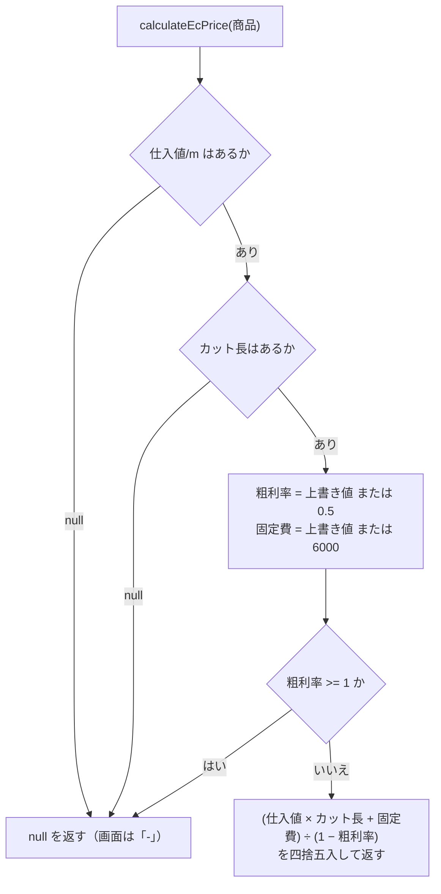

粗利率が 100% 以上だと 0 除算または負値になるため、`null` を返して計算を放棄します。編集画面で誤って 100 と入力した場合の保護です。

### カット長がどこから来るか

`cut_m` は EC 販売管理表の `size` 文字列から正規表現で抽出しています。

| size の値 | 抽出される幅 | 抽出されるカット長 |
|---|---|---|
| `1400mm*3ｍ` | 1400 | 3 |
| `910mm*30ｍ` | 910 | 30 |
| `50ｍ` | なし | 50 |

**この抽出に失敗すると価格が出ません。** 18,122 件中カット長が取れているのは 9,483 件（52%）です。

## 7. 現状のデータで各パターンが実際にどこまで機能するか

実装は動作していますが、**元データのカバレッジが低いため、パターンによって実用度が大きく異なります**。

### カバレッジの実測値（18,122 件中）

| 項目 | 件数 | 割合 |
|---|---|---|
| 材質あり | 15,080 | 83% |
| カット長あり | 9,483 | 52% |
| 在庫表と突合できた | 3,367 | 19% |
| 仕入値あり | 3,167 | 17% |
| **算出販売価格が出る** | **2,937** | **16%** |
| 在庫残あり | 3,363 | 19% |
| **目開きあり** | **263** | **1.5%** |

### パターン別の実用度

| パターン | 実用度 | 理由 |
|---|---|---|
| A: 材質 + 目開き | **限定的** | 目開きを持つのが 263 件のみ。ナイロン + 150〜250μ で 22 件は出るが、本来該当する商品を取りこぼしている可能性が高い |
| B: 材質未確定・スペックのみ | **限定的だが機能する** | 目開き 150〜250 で 42 件・うち 36 件に価格。要望どおりの出力が得られる。ただし母数は同じく 263 件に制限される |
| C: 品番直接指定 | **実用的** | 品番は 13,127 件（72%）にある。ただし価格が出るかは別問題で、突合できた 19% に限られる |
| D: EC 品番から逆引き | **実用的** | EC 品番は全件にある。突合状況に依存しない。ただし算出価格が出るのは 16% |
| E: フリーワード | **実用的** | 材質・品番・サイズが揃っているため当たりをつける用途では機能する |
| F: 在庫切れ時の代替提案 | **未実装** | 在庫残の列すら表示されていない |

### 目開き 1.5% の原因

在庫表側には目開きが 95%（2,594 行中 2,469 行）入っています。取り込みの問題ではなく、**在庫表と EC 販売管理表で品番の体系が異なる**ことが原因です。

- 在庫表(メッシュ)の品番 1,131 種と EC 管理表の品番 1,272 種のうち、共通するのは **218 種のみ**
- 突合ロジックはそのうち 217 種を拾えており、取りこぼしは 1 種だけです。ロジックの不具合ではありません
- EC 品番は `#1000Φ0.009` のようにメッシュ数と線径を文字列に埋め込む体系、在庫表は `#3555-F ソフト` `100-55PTW` のような別体系です

**解消には在庫表と EC 管理表の品番対応表が必要です。** これはくればぁ様に確認すべき事項です。

## 8. 編集（オーバーライド）のフロー

仕入値が入っていない商品や、仕入値が変更された商品に対して、営業担当者がその場で値を入れられます。

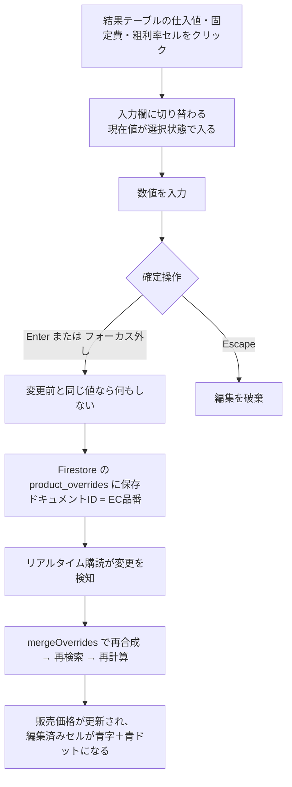

**日本語入力への配慮**: 変換確定の Enter が保存操作にならないよう、IME 変換中のキー入力を無視しています。

**粗利率の入力単位**: 画面では「50%」と表示され、入力も 50 と打ちます。内部では 0.5 として保存されます。

**保存先が未設定の場合**: 環境変数が設定されていない環境では、3 列がグレーの読み取り専用表示になり、検索フォームの上に「編集は現在無効です」という注記が出ます。以前は編集できるように見えて保存だけが黙って失敗していましたが、2026-07-27 に修正済みです。

## 9. 設計上の未解決事項

フローを整理する中で明らかになった、仕様として決めるべき点を挙げます。

**1. 在庫残がテーブルに出ていない**

データには 3,363 件分の在庫残があるにもかかわらず、列がありません。旧フローの「在庫表に戻って確認」を解消できていないため、列の追加が必要です。

**2. カテゴリタブが機能していない**

メッシュ・ネトロン・トリカルのタブがありますが、実際には全カテゴリが混在表示されます。`zaiko_source` で分類できるため実装は可能ですが、そもそもカテゴリで分ける必要があるのかを含めて確認が必要です。

**3. 目開きの「前後も表示」が手動**

要望は「200 と入れたら前後も出す」ですが、現状は最小 150・最大 250 のように利用者が範囲を手入力します。中心値と許容幅を入力する形式のほうが要望に近い可能性があります。

**4. 材質の複数指定ができない**

「ナイロンまたはポリエステルまたは PP」を 1 回で検索できません。材質未確定の問い合わせが一定数ある以上、材質のチェックボックス選択（複数可）に変える価値があります。

**5. 材質名の表記とデータが一致しない**

「ポリエステル」で検索すると 0 件になります（データ上は `PET`）。材質名の別名辞書を持つか、材質欄をプルダウン選択にする必要があります。

**6. 見積書への出力手段がない**

金額を確認した後、見積書への転記は手作業です。選択した行を CSV やクリップボードに出力する機能があると、旧フローの最後の 1 ステップも短縮できます。
